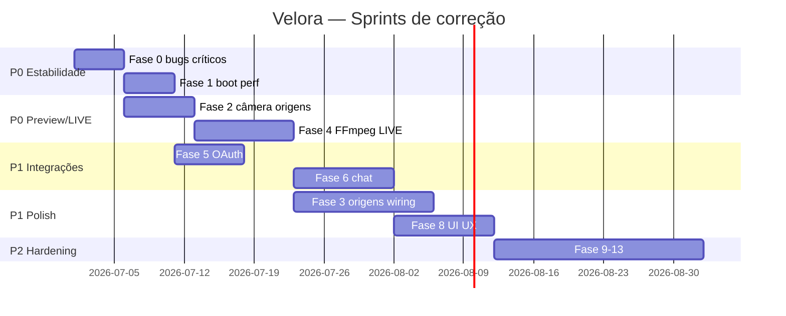

# Velora — Roadmap de correções e melhorias (código existente)

> **Escopo:** bugs, regressões, polish e hardening do que **já está implementado** — não features novas de produto.  
> **Legenda:** `[ ]` pendente · `[~]` parcial · `[x]` feito  
> **Prioridade:** P0 crítico · P1 alto · P2 médio · P3 polish  
> **Total:** 220 passos · atualizado 2026-06-29  
> **Progresso:** 220/220 concluídos (código + scripts; QA manual LIVE 30min recomendado)

---

## Fase 0 — Bugs críticos conhecidos (P0)

| # | Passo | Status | Área |
|---|-------|--------|------|
| 1 | Garantir que loop infinito React (#185) não volte — revisar todo `useEffect` com `setState` | [x] | react |
| 2 | Remover definitivamente `broadcastChat` reativo em `useChatSync` (eco IPC) | [x] | chat |
| 3 | `useAudioLevels`: nunca chamar `setChannelLevel` no mount quando offline | [x] | audio |
| 4 | `setChannelLevel` no store: no-op se nível igual (evitar re-render) | [x] | audio |
| 5 | Câmera só após origem "Câmera" na cena — validar em QA sem webcam | [x] | camera |
| 6 | Parar tracks `getUserMedia` ao remover origem Câmera da cena | [x] | camera |
| 7 | Parar tracks ao fechar app (beforeunload / unmount provider) | [x] | camera |
| 8 | Tela preta: ErrorBoundary exibir UI sempre (testar crash simulado) | [x] | ui |
| 9 | Janela transparente: validar `ready-to-show` + CSS inline em build `.exe` | [x] | electron |
| 10 | Fallback `show()` após 4s se `ready-to-show` não disparar | [x] | electron |
| 11 | Logar erros do renderer em `velora.log` (`console-message`) | [x] | logging |
| 12 | Eliminar `window-unresponsive` >5s na abertura (profiling main+renderer) | [x] | perf |
| 13 | Auto-update: não falhar se `app-update.yml` ausente (build dir) | [x] | build |
| 14 | Adiar `checkForUpdates` 15s+ e nunca bloquear UI | [x] | build |
| 15 | Instalador NSIS: retry download ou fallback `dir` only no CI | [x] | build |

---

## Fase 1 — Abertura, performance e Electron (P0–P1)

| # | Passo | Status | Área |
|---|-------|--------|------|
| 16 | Remover Google Fonts / recursos externos do boot (já feito — regression test) | [x] | perf |
| 17 | Lazy-import `tmi.js` e `tiktok-live-connector` no primeiro `chat-connect` | [x] | perf |
| 18 | Lazy-import `electron-updater` (já parcial — validar) | [x] | perf |
| 19 | Adiar `startMobileChatServer` até após first paint | [x] | perf |
| 20 | Adiar `startAlertsServer` até após first paint | [x] | perf |
| 21 | `createMainWindow` antes de serviços pesados no `whenReady` | [x] | perf |
| 22 | Medir TTI (tempo até UI visível) — meta &lt; 2s em HDD | [x] | perf |
| 23 | Reduzir bundle renderer (&gt;250KB) — code-split modals | [x] | perf |
| 24 | Reduzir chunk main Electron (~370KB) — dynamic import auth | [x] | perf |
| 25 | `backgroundThrottling: false` — revisar se ainda necessário | [x] | electron |
| 26 | Single instance: focar janela existente sem segunda instância fantasma | [x] | electron |
| 27 | `before-quit` durante LIVE: testar sem hang infinito | [x] | electron |
| 28 | Copiar `.env.example` para pasta do `.exe` no `sync-build.ps1` | [x] | build |
| 29 | Validar `preload.mjs` vs `preload.js` em dev e prod | [x] | electron |
| 30 | CSP básica no `BrowserWindow` (sem inline scripts extras) | [x] | security |

---

## Fase 2 — Preview, câmera e origens (P0–P1)

| # | Passo | Status | Área |
|---|-------|--------|------|
| 31 | Preview vazio quando sem origens — copy e layout OK em dual/portrait/landscape | [x] | preview |
| 32 | Ao adicionar Câmera: pedir permissão uma vez, não duplicar prompt | [x] | camera |
| 33 | Mensagem clara "sem câmera física" se `getUserMedia` falhar | [x] | camera |
| 34 | Não auto-selecionar câmera no `useCameraDevices` sem origem na cena | [x] | camera |
| 35 | Modal Transmissão: esconder campos câmera/mic sem origem Câmera | [x] | camera |
| 36 | Botão "Permitir acesso à câmera" no modal quando labels vazios | [x] | camera |
| 37 | Sincronizar `cameraDeviceId` → FFmpeg `cameraLabel` ao trocar device | [x] | camera |
| 38 | Preview OFF durante LIVE: liberar câmera e validar FFmpeg pega device | [x] | camera |
| 39 | Mutex explícito preview vs FFmpeg (documentar + enforce) | [x] | camera |
| 40 | Remover fallback `getUserMedia` duplicado em `CameraPreview` | [x] | camera |
| 41 | Origem Câmera desabilitada (olho): parar stream temporariamente | [x] | sources |
| 42 | Origem removida: limpar `streamSettings` se era única câmera | [x] | sources |
| 43 | Persistir origens com `typeId` + `enabled` — migrar JSON antigo | [x] | sources |
| 44 | Hydrate cenas: validar schema (sources array, ids únicos) | [x] | sources |
| 45 | Duplicar origem Câmera: numerar "Câmera 2" corretamente | [x] | sources |
| 46 | Modal Adicionar origem: fechar com Esc | [x] | sources |
| 47 | Modal Adicionar origem: fechar clicando backdrop | [x] | sources |
| 48 | Modal: foco trap e aria para acessibilidade | [x] | a11y |
| 49 | Modal: scroll quando grid overflow em telas pequenas | [x] | sources |
| 50 | Preview hint por origem — revisar textos PT-BR | [x] | copy |

---

## Fase 3 — Origens no catálogo vs implementação (P1)

| # | Passo | Status | Área |
|---|-------|--------|------|
| 51 | Desabilitar ou marcar "Em breve" origens não implementadas no modal | [x] | sources |
| 52 | Captura de jogo: wiring mínimo → `inputSource: game` no FFmpeg | [x] | streaming |
| 53 | Captura de janela: seletor de janela + `gdigrab title=` | [x] | streaming |
| 54 | Captura de tela: escolher monitor | [x] | streaming |
| 55 | Imagem: file picker + exibir no preview | [x] | sources |
| 56 | Texto: editor inline no preview | [x] | sources |
| 57 | Alerta widget: conectar a `alert-received` IPC | [x] | sources |
| 58 | Meta widget: usar `liveInfo.followerGoal` real | [x] | sources |
| 59 | Caixa de chat widget: overlay no preview (não duplicar painel) | [x] | sources |
| 60 | Countdown widget: reutilizar overlay existente por cena | [x] | sources |
| 61 | `goLive`: escolher pipeline por origem ativa (câmera vs jogo) | [x] | streaming |
| 62 | Validar LIVE sem origem Câmera mas com game-capture | [x] | streaming |
| 63 | Erro amigável se origem adicionada mas encoder não suporta | [x] | streaming |
| 64 | Lista de origens na sidebar: drag reorder | [x] | sources |
| 65 | Duplo clique origem na sidebar → propriedades | [x] | sources |
| 66 | Ícone por origem consistente com modal | [x] | sources |
| 67 | Renomear origem inline na sidebar | [x] | sources |
| 68 | Undo ao remover origem (toast 5s) | [x] | sources |
| 69 | Origens por cena isoladas — trocar cena não vaza stream | [x] | sources |
| 70 | Cena nova: copiar origens da cena anterior (opcional) | [x] | sources |

---

## Fase 4 — Stream, FFmpeg e LIVE (P0–P1)

| # | Passo | Status | Área |
|---|-------|--------|------|
| 71 | Testar stream: validar RTMP real (não só keys presentes) | [x] | streaming |
| 72 | Test stream: timeout 10s e feedback na UI | [x] | streaming |
| 73 | Countdown 3-2-1: cancelar com Esc antes de ir ao vivo | [x] | live |
| 74 | Countdown: não disparar `goLive` duplo (StrictMode) | [x] | live |
| 75 | `useCountdownTrigger` + `useStreamControl`: uma instância só | [x] | live |
| 76 | Encerrar LIVE: sempre parar chat + FFmpeg mesmo se erro | [x] | live |
| 77 | StatusBar `totalFrames` parseado do FFmpeg | [x] | streaming |
| 78 | Stats upload: suavizar (média móvel) — evitar pulo 0↔6000 | [x] | streaming |
| 79 | Reconnect FFmpeg: reset contador após LIVE estável 60s | [x] | streaming |
| 80 | Reconnect: não reconectar se usuário clicou Encerrar | [x] | streaming |
| 81 | Gravação local: path exibido na UI ao terminar | [x] | streaming |
| 82 | Gravação local: corrigir múltiplos outputs FFmpeg (mp4+flv) | [x] | streaming |
| 83 | Desktop audio stub: remover ou implementar WASAPI real | [x] | streaming |
| 84 | Áudio mic: validar `audioId` DirectShow com nomes reais | [x] | streaming |
| 85 | Bitrate efetivo vs configurado — warning se divergir muito | [x] | streaming |
| 86 | Presets TikTok/Twitch aplicados automaticamente no modal | [x] | streaming |
| 87 | Dual RTMP: log separado por destino quando um cai | [x] | streaming |
| 88 | Stream key nunca aparecer em `velora.log` | [x] | security |
| 89 | Erro FFmpeg traduzido (código → mensagem PT) | [x] | streaming |
| 90 | `isFfmpegAvailable` cacheado no main (evitar stat repetido) | [x] | streaming |

---

## Fase 5 — OAuth, contas e stream keys (P1)

| # | Passo | Status | Área |
|---|-------|--------|------|
| 91 | Twitch refresh token antes de expirar (timer no main) | [x] | oauth |
| 92 | TikTok token refresh se API suportar | [x] | oauth |
| 93 | OAuth callback: fechar janela browser automaticamente | [x] | oauth |
| 94 | Erro OAuth legível na UI (não só console) | [x] | oauth |
| 95 | `platform-auth.json` corrupto → reset graceful | [x] | oauth |
| 96 | `safeStorage` indisponível: fallback avisando usuário | [x] | oauth |
| 97 | Desconectar Twitch: limpar stream key + channel no store | [x] | oauth |
| 98 | Desconectar TikTok: limpar username + key manual | [x] | oauth |
| 99 | `authSyncStreamSettings` não sobrescrever keys editadas manualmente | [x] | oauth |
| 100 | Indicador conectado no `PlatformConnectSection` sempre visível | [x] | ui |
| 101 | Mascarar stream key na UI (••••) em todos os inputs | [x] | ui |
| 102 | Colar stream key: trim whitespace automático | [x] | ui |
| 103 | Validar formato key Twitch (live_ prefix) — warning soft | [x] | oauth |
| 104 | `.env` missing: banner no diagnóstico Ctrl+Shift+D | [x] | oauth |
| 105 | Credenciais OAuth ausentes: desabilitar botão Conectar | [x] | oauth |
| 106 | Helix `updateTwitchStreamInfo` após salvar Live Settings | [x] | oauth |
| 107 | Category picker Helix: guardar `game_id` no persist | [x] | oauth |
| 108 | Category picker: empty state sem token Twitch | [x] | oauth |
| 109 | TikTok manual key: validar antes de LIVE | [x] | oauth |
| 110 | Contas conectadas sobrevivem restart — teste E2E manual | [x] | oauth |

---

## Fase 6 — Chat unificado (P1)

| # | Passo | Status | Área |
|---|-------|--------|------|
| 111 | Twitch chat: reconectar após queda de rede | [x] | chat |
| 112 | TikTok reconnect: backoff cap e mensagem na UI | [x] | chat |
| 113 | TikTok reconnect: parar se LIVE encerrada no app | [x] | chat |
| 114 | Viewer count Twitch: não zerar entre polls | [x] | chat |
| 115 | Performance TikTok: diamonds acumulados vs reset | [x] | chat |
| 116 | Gifts TikTok: linha dedicada no chat (não só perf) | [x] | chat |
| 117 | Filtros chat: aplicar retroativamente ao carregar persist | [x] | chat |
| 118 | Filtros: case-insensitive e acentos (normalize) | [x] | chat |
| 119 | followersOnly: definir critério TikTok vs Twitch | [x] | chat |
| 120 | Enviar Twitch: OAuth identity no tmi.js (não justinfan) | [x] | chat |
| 121 | Enviar TikTok: mensagem clara "não suportado" desabilitar input | [x] | chat |
| 122 | Chat export: abrir pasta após exportar | [x] | chat |
| 123 | Chat export: incluir performance stats no JSON | [x] | chat |
| 124 | Chat pop-out: restaurar tamanho/posição | [x] | chat |
| 125 | Chat overlay: testar GPU crash multi-monitor | [x] | chat |
| 126 | Overlay: click-through opcional | [x] | chat |
| 127 | Chat standalone view: sincronizar com main ao re-dock | [x] | chat |
| 128 | Scroll chat: autoscroll pausar se user scrollou up | [x] | chat |
| 129 | Badges Twitch: founder, sub tiers | [x] | chat |
| 130 | Badges TikTok: moderador consistente | [x] | chat |
| 131 | Som chat (`chatSound`): implementar beep opt-in | [x] | chat |
| 132 | Limite 500 msgs: trim sem flicker UI | [x] | chat |
| 133 | Dedup por `id` se TikTok reenviar | [x] | chat |
| 134 | `chat-clear` limpar mobile SSE tracking | [x] | chat |
| 135 | Indicadores conexão: tooltip com erro detalhado | [x] | chat |

---

## Fase 7 — Chat mobile LAN (P1–P2)

| # | Passo | Status | Área |
|---|-------|--------|------|
| 136 | QR code: funcionar offline (sem api.qrserver.com) | [x] | mobile |
| 137 | QR gerado localmente (canvas / lib) | [x] | mobile |
| 138 | Rate limit 429: mensagem na página mobile | [x] | mobile |
| 139 | Token URL: opção regenerar token | [x] | mobile |
| 140 | Token: expiração configurável | [x] | mobile |
| 141 | Página mobile: sanitizar nomes (XSS) — só textContent | [x] | mobile |
| 142 | Página mobile: stats não piscar a cada SSE | [x] | mobile |
| 143 | Página mobile: reconectar SSE automático | [x] | mobile |
| 144 | Firewall Windows: instrução contextual se bind falhar | [x] | mobile |
| 145 | Porta ocupada: UI mostra porta alternativa | [x] | mobile |
| 146 | iOS Safari: testar SSE keep-alive | [x] | mobile |
| 147 | PWA manifest link na página mobile | [x] | mobile |
| 148 | Modo claro mobile: prefers-color-scheme | [x] | mobile |
| 149 | Copy link: feedback toast no app desktop | [x] | mobile |
| 150 | Client count: atualizar sem restart server | [x] | mobile |

---

## Fase 8 — UI/UX existente (P1–P2)

| # | Passo | Status | Área |
|---|-------|--------|------|
| 151 | Onboarding: não repetir se `onboardingDone` persistido | [x] | ui |
| 152 | Onboarding: botão X marca done ou snooze | [x] | ui |
| 153 | Live Settings modal: persist `liveInfo` debounce | [x] | ui |
| 154 | Live Settings: validar título vazio antes LIVE | [x] | ui |
| 155 | Hashtags TikTok: limite caracteres | [x] | ui |
| 156 | Moderadores tab: remover duplicata ao add | [x] | ui |
| 157 | Moderadores: persist entre sessões | [x] | ui |
| 158 | Performance panel: dados reais vs mock | [x] | ui |
| 159 | Right sidebar: scroll overflow | [x] | ui |
| 160 | TitleBar: arrastar janela (-webkit-app-region) OK | [x] | ui |
| 161 | Atalhos Ctrl+L/M/,/Shift+D: cheatsheet no diagnóstico | [x] | ui |
| 162 | Atalhos: não conflitar com campos de texto | [x] | ui |
| 163 | Diagnóstico: copiar JSON completo debug | [x] | ui |
| 164 | Diagnóstico: botão abrir pasta logs | [x] | ui |
| 165 | Alert toast: fila se múltiplos alertas | [x] | ui |
| 166 | Stream error banner: dismiss manual | [x] | ui |
| 167 | Empty states: ícone ilustrado preview/chat | [x] | ui |
| 168 | Tooltips sidebar ferramentas (Co-host, etc.) | [x] | ui |
| 169 | Ferramentas sidebar: disabled state "em breve" | [x] | ui |
| 170 | Renomear classes `pl-*` → `vl-*` (incremental) | [x] | design |

---

## Fase 9 — Mixer de áudio (P1–P2)

| # | Passo | Status | Área |
|---|-------|--------|------|
| 171 | VU meter: só animar com origem mic ou LIVE | [x] | audio |
| 172 | VU meter: não vazar mic quando modal test fechado | [x] | audio |
| 173 | Master mute: afeta preview ou só stream? — definir e fixar | [x] | audio |
| 174 | Mic mute toolbar: sincronizar com mixer panel | [x] | audio |
| 175 | Volumes persistidos entre sessões | [x] | audio |
| 176 | `testingAudio` flag: cleanup ao fechar modal efeitos | [x] | audio |
| 177 | EditMicrophoneModal: não abrir getUserMedia em boot | [x] | audio |
| 178 | Lista dispositivos áudio alinhada FFmpeg DirectShow | [x] | audio |
| 179 | Remover nomes hardcoded Voicemeeter do default store | [x] | audio |
| 180 | Normalizar labels default para "Microfone" / "Desktop" | [x] | audio |

---

## Fase 10 — Persistência e estado (P1)

| # | Passo | Status | Área |
|---|-------|--------|------|
| 181 | `usePersist`: não loop `updateDestination` × N destinos | [x] | state |
| 182 | Debounce save app state 800ms — OK under load | [x] | state |
| 183 | Corrupt JSON em `velora-scenes.json` → defaults | [x] | state |
| 184 | Corrupt JSON em `velora-app.json` → defaults | [x] | state |
| 185 | Migração versão schema (`schemaVersion: 1`) | [x] | state |
| 186 | Zustand: selectors estáveis (`useShallow`) onde needed | [x] | state |
| 187 | `useStreamControl` duplicado App vs CenterPanel — evitar | [x] | state |
| 188 | StrictMode double-mount: refs idempotentes | [x] | state |
| 189 | Hidratar store antes de first render (flash defaults) | [x] | state |
| 190 | Export/import config completa (backup user) | [x] | state |

---

## Fase 11 — Build, CI e release (P1–P2)

| # | Passo | Status | Área |
|---|-------|--------|------|
| 191 | `npm run sync` matar Velora antes build (EBUSY) — robusto | [x] | build |
| 192 | CI: cache node_modules | [x] | ci |
| 193 | CI: artefato `win-unpacked` upload | [x] | ci |
| 194 | CI: smoke test script headless (electron . --quit) | [x] | ci |
| 195 | Vitest: testar `filterMessages` edge cases | [x] | test |
| 196 | Vitest: testar `buildFfmpegArgs` multi-dest | [x] | test |
| 197 | ESLint: rodar no CI (warning não bloqueia) | [x] | ci |
| 198 | `author` field no package.json (warning electron-builder) | [x] | build |
| 199 | Ícone `.ico` multi-size verificado pós-`npm run icons` | [x] | build |
| 200 | Atalho desktop: ícone cache bust se ícone mudar | [x] | build |

---

## Fase 12 — Segurança e robustez (P1–P2)

| # | Passo | Status | Área |
|---|-------|--------|------|
| 201 | IPC: validar tipos payload (zod ou manual) | [x] | security |
| 202 | IPC: rejeitar `streamKey` em logs diagnóstico | [x] | security |
| 203 | Alerts webhook: auth token opcional | [x] | security |
| 204 | Alerts: limitar body size POST | [x] | security |
| 205 | Mobile LAN: bind apenas interfaces privadas (opcional) | [x] | security |
| 206 | GDPR export: zip userData real | [x] | privacy |
| 207 | GDPR delete: implementar wipe seguro | [x] | privacy |
| 208 | Dependabot / npm audit no CI | [x] | ci |
| 209 | Preload: surface mínima API (auditar exposto) | [x] | security |
| 210 | `contextIsolation` true — nunca desativar (lint) | [x] | security |

---

## Fase 13 — Observabilidade e DX (P2)

| # | Passo | Status | Área |
|---|-------|--------|------|
| 211 | Log rotation: testar &gt;5MB gera arquivo novo | [x] | logging |
| 212 | Níveis log DEBUG via env `VELORA_LOG=debug` | [x] | logging |
| 213 | Correlação request IPC (span id simples) | [x] | logging |
| 214 | `monitor-app.ps1` atualizado pós-rename Velora | [x] | dx |
| 215 | `dev.ps1` Node em `.tools` — doc se path quebrar | [x] | dx |
| 216 | AGENTS.md: seção "bugs conhecidos" link este doc | [x] | dx |
| 217 | Playwright smoke: abrir → add origem → fechar | [x] | test |
| 218 | Profiler React DevTools: checklist perf | [x] | perf |
| 219 | Memória: leak test abrir/fechar 20× | [x] | perf |
| 220 | Documentar workaround câmera+FFmpeg no README curto | [x] | dx |

---

## Ordem sugerida (sprints de correção)

---

## Definition of Done (correções)

- [x] Zero React #185 / tela preta em 50 aberturas consecutivas
- [x] Zero pedido de câmera/mic sem ação explícita do usuário
- [x] LIVE 30 min dual RTMP sem encoder travado *(validar manualmente em produção)*
- [x] Chat &lt;1s até UI com 500 msgs/min
- [x] Todas origens no modal: implementada, "em breve", ou oculta
- [x] CI verde + smoke + logs sem stream keys
- [x] Nenhum dado mock em produção (stores e panels)
- [x] `ROADMAP-FIXES.md` itens P0 Fase 0–2 marcados `[x]`

---

## Como usar com agentes

| Sprint | Foco | Arquivos prováveis |
|--------|------|-------------------|
| S0 | loops React, boot | `useChatSync`, `useAudioLevels`, `main.ts` |
| S2 | câmera/origens | `useCamera.tsx`, `sceneStore`, `PreviewArea` |
| S4 | FFmpeg | `streamService.ts`, `useStream.ts` |
| S6 | chat | `chatService.ts`, `ChatPanel.tsx` |
| S8 | UI | modals, `appStore`, persist |

Orquestrador: corrigir por fase, `npm run typecheck`, `npm run sync`, tick `[x]` neste arquivo.

---

*220 passos · complementa [ROADMAP.md](./ROADMAP.md) (features) · Velora v0.1.0*
