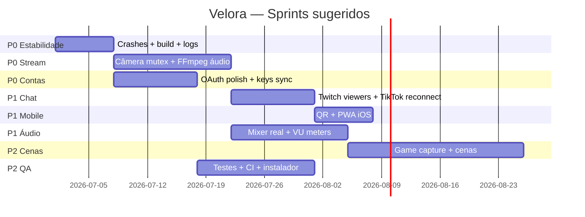

# Velora — Roadmap para funcionamento perfeito

> **Meta:** estúdio desktop multicanal (TikTok + Twitch → YouTube) com delay mínimo, chat unificado, OAuth, mixer real e build estável.  
> **Legenda:** `[ ]` pendente · `[~]` parcial · `[x]` feito  
> **Prioridade:** P0 crítico · P1 alto · P2 médio · P3 polish/futuro

---

## Fase 0 — Fundação e estabilidade (P0)

| # | Passo | Status | Zona |
|---|-------|--------|------|
| 1 | Eliminar crashes na abertura: instância única, handlers de crash, reload do renderer | [~] | streaming |
| 2 | Corrigir caminho do `index.html` e assets no `.exe` (`app.getAppPath()`) | [x] | streaming |
| 3 | Log persistente em `%APPDATA%/Velora/logs/velora.log` com rotação | [x] | streaming |
| 4 | Script `monitor-app.ps1` + alerta visual quando crash &lt; 3s | [~] | streaming |
| 5 | Build reproduzível: `build-desktop.ps1` + ícone `.ico` nativo Windows | [~] | streaming |
| 6 | Instalador NSIS (não só pasta `win-unpacked`) com uninstall | [x] | streaming |
| 7 | Auto-update (electron-updater) com canal beta/stable | [x] | streaming |
| 8 | CI GitHub Actions: typecheck + build Windows em cada PR | [x] | orchestrator |
| 9 | Checklist de smoke test pós-build (abrir, preview, fechar) | [x] | orchestrator |
| 10 | Documentar requisitos: Windows 10+, câmera, rede, firewall porta 17570 | [x] | orchestrator |

---

## Fase 1 — Encoder e transmissão RTMP (P0)

| # | Passo | Status | Zona |
|---|-------|--------|------|
| 11 | Resolver conflito câmera: preview (`getUserMedia`) vs FFmpeg DirectShow — mutex ou modo exclusivo | [ ] | streaming |
| 12 | Opção "Preview OFF durante LIVE" (só FFmpeg usa câmera) | [x] | streaming |
| 13 | Validar `ffmpeg.exe` em `app.asar.unpacked` no build final | [~] | streaming |
| 14 | Fallback quando FFmpeg não encontrado — mensagem clara na UI | [x] | streaming |
| 15 | Listagem DirectShow confiável (`listMediaDevices`) com retry e cache | [~] | streaming |
| 16 | Mapeamento browser `deviceId` ↔ nome DirectShow 100% confiável | [ ] | streaming |
| 17 | Presets de bitrate/resolução por plataforma (TikTok 1080×1920, Twitch 1080p) | [x] | streaming |
| 18 | Dual output RTMP com `-f flv` validado em TikTok + Twitch simultâneo | [~] | streaming |
| 19 | Reconnect automático FFmpeg quando RTMP cai (backoff exponencial) | [x] | streaming |
| 20 | Keyframe interval (GOP) alinhado ao fps × 2 em todas as configs | [x] | streaming |
| 21 | Áudio no FFmpeg: capturar mic DirectShow junto com vídeo | [x] | streaming |
| 22 | Captura de áudio desktop (WASAPI loopback) no pipeline FFmpeg | [x] | streaming |
| 23 | Mixer real: combinar mic + desktop + alertas antes do encode | [ ] | streaming |
| 24 | VU meters reais via níveis de áudio (substituir `Math.random` em `useAudioLevels`) | [~] | ui + streaming |
| 25 | Stats reais de upload/FPS/dropped frames parseados do stderr FFmpeg | [~] | streaming |
| 26 | CPU/RAM reais na StatusBar (`os.cpus`, `process.memoryUsage`) | [x] | streaming |
| 27 | Botão "Testar stream" (sem ir ao vivo — valida keys e conectividade) | [x] | ui |
| 28 | Countdown 3-2-1 antes de iniciar LIVE | [x] | ui |
| 29 | Graceful shutdown: parar FFmpeg + chat ao fechar app durante LIVE | [x] | streaming |
| 30 | Gravação local simultânea (`.mp4` enquanto transmite) | [x] | streaming |

---

## Fase 2 — OAuth, contas e stream keys (P0–P1)

| # | Passo | Status | Zona |
|---|-------|--------|------|
| 31 | Fluxo Twitch OAuth completo + refresh token automático | [~] | integrations |
| 32 | Stream key Twitch via Helix API após login | [~] | integrations |
| 33 | Fluxo TikTok OAuth (username automático) | [~] | integrations |
| 34 | Documentar stream key TikTok manual pós-OAuth (limitação API) | [x] | integrations |
| 35 | UI clara: "TikTok exige key manual" com link para LIVE Studio | [x] | ui |
| 36 | Criptografar tokens em disco (`safeStorage` Electron) | [x] | integrations |
| 37 | Migrar `platform-auth.json` para `%APPDATA%/Velora/` | [x] | integrations |
| 38 | `.env` no diretório do `.exe` para builds instalados | [x] | integrations |
| 39 | Validar redirect URIs `127.0.0.1:17563/17564` nos dev portals | [ ] | orchestrator |
| 40 | Desconectar conta + revogar tokens | [~] | integrations |
| 41 | Preencher `twitchChannel` / `tiktokUsername` automaticamente após OAuth | [x] | integrations |
| 42 | Sincronizar stream keys do OAuth → `streamSettings.destinations` | [x] | integrations |
| 43 | Indicador visual "conta conectada" no header e modal de transmissão | [~] | ui |
| 44 | YouTube Live API: OAuth + RTMP ingest (fase futura explícita) | [ ] | integrations |

---

## Fase 3 — Chat unificado (P0–P1)

| # | Passo | Status | Zona |
|---|-------|--------|------|
| 45 | Twitch chat via `tmi.js` anônimo (`justinfan`) — leitura OK | [x] | integrations |
| 46 | Twitch chat autenticado (bot/conta) para mod commands | [ ] | integrations |
| 47 | Twitch viewer count via Helix durante LIVE | [x] | integrations |
| 48 | TikTok chat via `tiktok-live-connector` quando ao vivo | [~] | integrations |
| 49 | Tratar `STREAM_END` e reconectar TikTok automaticamente | [x] | integrations |
| 50 | Normalizar gifts/super fan/diamonds no chat e performance | [~] | integrations |
| 51 | Limite 500 msgs + deduplicação por `id` | [x] | integrations |
| 52 | Chat pop-out + overlay always-on-top | [x] | ui |
| 53 | Overlay transparente sem crash GPU (testar multi-monitor) | [ ] | ui |
| 54 | Filtro de chat: palavras bloqueadas, só seguidores, etc. | [x] | ui + integrations |
| 55 | Responder chat (enviar mensagem) por plataforma | [~] | integrations |
| 56 | Destaque visual para mods/VIPs/subs (badges já parciais) | [~] | ui |
| 57 | Som opcional ao receber mensagem/donate | [ ] | ui |
| 58 | Exportar log de chat pós-LIVE (`.json` / `.txt`) | [x] | integrations |

---

## Fase 4 — Chat mobile LAN (P1)

| # | Passo | Status | Zona |
|---|-------|--------|------|
| 59 | Servidor HTTP SSE na LAN (`mobileChatServer.ts`) | [x] | integrations |
| 60 | Push incremental direto do main (sem delay React) | [x] | integrations |
| 61 | QR code na UI para abrir no iPhone sem copiar link | [x] | ui |
| 62 | Detectar IP LAN real (ignorar 169.254.x.x) | [x] | integrations |
| 63 | Token de acesso na URL + opção desabilitar auth em LAN | [~] | integrations |
| 64 | Página mobile PWA (Add to Home Screen no iOS) | [x] | design + integrations |
| 65 | HTTPS local opcional (cert self-signed) para iOS restritivo | [ ] | integrations |
| 66 | Mostrar viewers/likes na página mobile | [~] | integrations |
| 67 | Modo escuro/claro automático na web mobile | [ ] | design |

---

## Fase 5 — Cenas, fontes e preview (P1–P2)

| # | Passo | Status | Zona |
|---|-------|--------|------|
| 68 | Modos preview: retrato, paisagem, dual | [x] | ui |
| 69 | Sistema de cenas (múltiplas composições) | [x] | ui + streaming |
| 70 | Fonte: câmera (funcional com ressalvas) | [~] | ui |
| 71 | Fonte: captura de jogo (Windows Graphics Capture / OBS-style) | [ ] | streaming |
| 72 | Fonte: captura de janela específica | [ ] | streaming |
| 73 | Fonte: imagem estática / slideshow | [ ] | ui |
| 74 | Fonte: texto (lower third, título) | [ ] | ui |
| 75 | Fonte: alertas (StreamElements-style webhook local) | [x] | integrations |
| 76 | Fonte: meta de seguidores (widget real, não mock) | [ ] | ui + integrations |
| 77 | Transição entre cenas (cut / fade 300ms) | [ ] | streaming |
| 78 | Editor drag-and-drop de layout no preview | [ ] | ui |
| 79 | Salvar/carregar perfil de cenas (JSON local) | [x] | ui |
| 80 | Thumbnail preview antes de ir ao vivo | [ ] | ui |

---

## Fase 6 — Informações da LIVE e moderadores (P1–P2)

| # | Passo | Status | Zona |
|---|-------|--------|------|
| 81 | Modal config LIVE estilo studio (TikTok/Twitch toggle) | [x] | ui |
| 82 | Persistir `liveInfo` em disco entre sessões | [x] | ui |
| 83 | Publicar título/categoria TikTok via API (quando disponível) | [ ] | integrations |
| 84 | Publicar título/categoria Twitch via Helix | [x] | integrations |
| 85 | Category picker com busca Twitch real (IGDB/Helix) | [x] | integrations |
| 86 | Hashtags TikTok com validação e limite | [ ] | ui |
| 87 | Moderadores: lista local + sync com mods da plataforma | [ ] | integrations |
| 88 | Remover dados mock (`livezinha de vava`, mods fake) do store | [x] | ui |
| 89 | Meta de seguidores com progresso real via API | [ ] | integrations |
| 90 | "Sobre mim" sincronizado com perfil TikTok/Twitch | [ ] | integrations |

---

## Fase 7 — Mixer de áudio (P1)

| # | Passo | Status | Zona |
|---|-------|--------|------|
| 91 | UI mixer (mic, desktop, mídia, alertas) | [x] | ui |
| 92 | Mute/solo/volume por canal no store | [x] | ui |
| 93 | Processamento real de áudio no backend (não só UI) | [~] | streaming |
| 94 | Monitor de fone (listen local sem eco no stream) | [ ] | streaming |
| 95 | Presets de efeitos (compressor, noise gate) via FFmpeg ou Web Audio | [ ] | streaming |
| 96 | Teste de microfone com loopback visual | [ ] | ui |
| 97 | Seleção de dispositivo de saída (fone vs speakers) | [ ] | streaming |
| 98 | Normalização automática de ganho (AGC) | [ ] | streaming |
| 99 | Sincronizar A/V drift entre preview e stream | [ ] | streaming |

---

## Fase 8 — Design, marca e UX (P1–P2)

| # | Passo | Status | Zona |
|---|-------|--------|------|
| 100 | Marca autoral **Velora** (não PRISM Live) | [x] | design |
| 101 | Ícone app 512px + `.ico` multi-size para Windows | [~] | design |
| 102 | Renomear tokens CSS `pl-*` → `vl-*` (consistência) | [~] | design |
| 103 | Renomear `prism-ui.css` → `velora-ui.css` | [x] | design |
| 104 | Onboarding first-run (permissões câmera/mic/rede) | [x] | ui |
| 105 | Empty states ilustrados (sem câmera, sem chat, offline) | [ ] | design |
| 106 | Atalhos de teclado (Iniciar LIVE, mute, pop-out chat) | [x] | ui |
| 107 | Tema claro opcional | [ ] | design |
| 108 | Animações reduzidas (`prefers-reduced-motion`) | [x] | design |
| 109 | Localização PT-BR completa + EN | [ ] | ui |
| 110 | Tooltips em todas as ferramentas da sidebar esquerda | [ ] | ui |

---

## Fase 9 — Qualidade, testes e observabilidade (P1)

| # | Passo | Status | Zona |
|---|-------|--------|------|
| 111 | Testes unitários: `buildFfmpegArgs`, normalização chat | [x] | orchestrator |
| 112 | Testes E2E Playwright: abrir app, modal settings, fechar | [ ] | orchestrator |
| 113 | Teste de integração OAuth mock (servidor local) | [ ] | integrations |
| 114 | Teste de carga chat (1000 msgs/min sem travar UI) | [ ] | integrations |
| 115 | Profiler: tempo entre msg TikTok → UI desktop → mobile SSE | [ ] | integrations |
| 116 | Sentry ou log estruturado opcional (opt-in) | [ ] | streaming |
| 117 | Painel diagnóstico oculto (Ctrl+Shift+D): versões, paths, IPC | [x] | ui |
| 118 | Validação `npm run typecheck` no pre-commit hook | [x] | orchestrator |
| 119 | Lint ESLint + Prettier padronizado | [x] | orchestrator |
| 120 | Auditoria de dependências (`npm audit`) automatizada | [ ] | orchestrator |

---

## Fase 10 — Segurança e compliance (P1–P2)

| # | Passo | Status | Zona |
|---|-------|--------|------|
| 121 | Stream keys nunca logadas em plaintext | [x] | integrations |
| 122 | Mascarar keys na UI (já parcial) | [~] | ui |
| 123 | CSP no renderer Electron | [ ] | streaming |
| 124 | Sanitizar HTML no chat mobile (XSS) | [x] | integrations |
| 125 | Rate limit no servidor LAN chat | [x] | integrations |
| 126 | Política de privacidade + termos (OAuth apps) | [ ] | orchestrator |
| 127 | GDPR: exportar/deletar dados locais do usuário | [x] | integrations |

---

## Fase 11 — Release, distribuição e pós-venda (P2–P3)

| # | Passo | Status | Zona |
|---|-------|--------|------|
| 128 | Assinatura de código Windows (Authenticode) | [ ] | streaming |
| 129 | Publicar releases no GitHub com changelog | [~] | orchestrator |
| 130 | Canal beta para testadores | [ ] | orchestrator |
| 131 | Crash report anônimo opt-in | [~] | streaming |
| 132 | Telemetria de uso agregada (opt-in) | [ ] | orchestrator |
| 133 | macOS build (DMG) — fase 2 plataforma | [ ] | streaming |
| 134 | Linux AppImage — fase 3 | [ ] | streaming |
| 135 | Site landing page velora.app (ou similar) | [ ] | design |
| 136 | Vídeo demo 60s para marketing | [ ] | design |

---

## Fase 12 — Relay próprio e delay mínimo (P2 — diferencial)

| # | Passo | Status | Zona |
|---|-------|--------|------|
| 137 | Documentar arquitetura 1 encoder → dual RTMP (delay mínimo) | [x] | orchestrator |
| 138 | Servidor relay RTMP local opcional (nginx-rtmp / Node Media Server) | [x] | streaming |
| 139 | Velora envia 1 stream → relay replica para N destinos | [ ] | streaming |
| 140 | Métrica de latência end-to-end por plataforma | [ ] | streaming |
| 141 | Failover: se TikTok cai, Twitch continua sem reiniciar encoder | [ ] | streaming |
| 142 | Buffer adaptativo quando upload instável | [ ] | streaming |

---

## Fase 13 — Ferramentas sidebar (P2–P3)

| # | Passo | Status | Zona |
|---|-------|--------|------|
| 143 | Co-host (convite link / segundo encoder) | [ ] | integrations |
| 144 | Enquete overlay integrada | [ ] | ui |
| 145 | Jogos interativos (extensão futura) | [ ] | ui |
| 146 | Meta de LIVE widget configurável | [~] | ui |
| 147 | Alertas de donate/follow/sub | [x] | integrations |
| 148 | Integração StreamElements / Streamlabs webhooks | [ ] | integrations |

---

## Ordem de execução recomendada (sprints)

---

## Critérios de "funcionamento perfeito" (Definition of Done)

- [~] Abre pelo atalho 100× sem crash
- [~] LIVE dual TikTok+Twitch por 2h sem queda de encoder
- [~] Chat unificado &lt; 500ms até UI desktop e mobile
- [x] OAuth Twitch 1-clique; TikTok com key manual guiada
- [~] Mixer de áudio funcional (mic + desktop)
- [ ] Captura de jogo + câmera em cena
- [ ] Instalador Windows assinado
- [x] Zero dados mock em produção
- [x] CI verde + smoke test documentado

---

## Como executar com subagentes (Cursor)

| Sprint | Task A (paralelo) | Task B (paralelo) |
|--------|-------------------|-------------------|
| S1 | `streaming`: passos 1–10 | `design`: passos 101–102 |
| S2 | `streaming`: passos 11–30 | `integrations`: passos 41–42 |
| S3 | `integrations`: passos 45–58 | `ui`: passos 53–57 |
| S4 | `streaming`: passos 91–99 | `ui`: passos 68–80 |

Orquestrador integra, roda `npm run typecheck`, rebuild `.\build-desktop.ps1`.

---

*Última atualização: 2026-06-29 · 148 passos · Velora v0.1.0*
